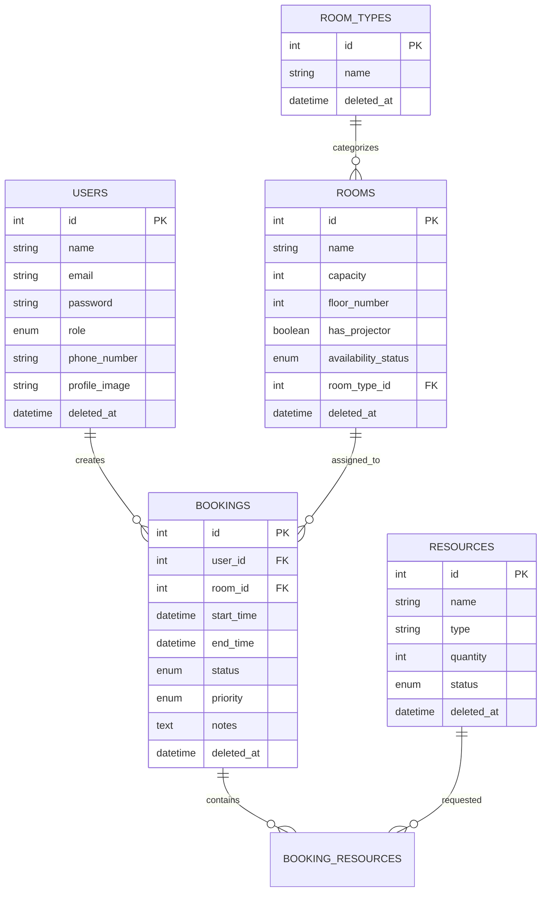

# Database Schema

## users

- `id` primary key
- `name`
- `email` unique
- `password` hashed
- `role` enum: `admin`, `employee`
- `phone_number`
- `profile_image`
- `deleted_at`

Relationship: one user has many bookings.

## room_types

- `id` primary key
- `name` unique
- `deleted_at`

Relationship: one room type has many rooms.

## rooms

- `id` primary key
- `name`Problem Statement: Room Booking & Resource Management System 
Build a simple full-stack web application where employees of a company can book meeting rooms and shared office resources (projectors, conference devices, speakers, etc.).

The purpose of this project is to help understand:

Node.js backend architecture

REST APIs

JWT Authentication

MySQL relationships

Models and migrations

React frontend structure

Basic design patterns

CRUD operations

Middleware usage

The project should be simple enough for a beginner intern, but structured enough to teach good engineering practices.

Tech Stack
Backend
Node.js

Express.js

MySQL

Sequelize ORM

JWT Authentication

Frontend
React.js

React Router

Axios

Main Features
1. Authentication Module
Users should be able to:

Register

Login

Logout

Requirements
Password hashing

JWT token generation

Protected APIs

Auth middleware

2. Meeting Room Management
Admins can:

Create rooms

Edit room details

Delete rooms

Room Data
Room Name

Capacity

Floor Number

Has Projector (Yes/No)

Availability Status

3. Resource Management
Admins can manage office resources like:

Projectors

Speakers

HDMI adapters

Conference cameras

Resource Data
Resource Name

Type

Quantity

Status

4. Booking System
Employees can:

Book a meeting room

Select date and time

Add required resources

Cancel booking

Booking Rules
Cannot double-book the same room at the same time

Booking must have start and end time

Past dates cannot be booked

5. Booking Approval System
Admins can:

Approve bookings

Reject bookings

Booking Status
Pending

Approved

Rejected

Cancelled

Database Requirements
The application should contain at least these tables:

users

rooms

resources

bookings

booking_resources

Relationship Expectations
One user can create many bookings

One booking belongs to one room

One booking can contain many resources

One resource can belong to many bookings

This will help the intern learn:

One-to-many relationships

Many-to-many relationships

Migration Tasks
The project must include Sequelize migrations.

Mandatory Migration Exercises
These changes should be added later after initial setup.

Migration 1
Add:

phone_number

profile_image

to users table.

Migration 2
Create a new table:
room_types

Examples:

Conference Room

Interview Room

Training Room

Then connect rooms table with room_types.

Migration 3
Add booking priority:

Values:

Normal

Urgent

Migration 4
Add soft delete support:

deleted_at

Backend Architecture Expectations
Expected folder structure:

src/
 ├── controllers/
 ├── routes/
 ├── models/
 ├── middlewares/
 ├── services/
 ├── migrations/
 ├── seeders/
 └── utils/
Design Patterns To Learn
This project should teach:

Middleware Pattern
Auth middleware

Error middleware

Service Layer Pattern
Move business logic out of controllers.

Repository Pattern (Optional)
Separate DB queries from services.

API Examples
Auth APIs
POST /auth/register

POST /auth/login

Room APIs
GET /rooms

POST /rooms

Booking APIs
POST /bookings

GET /bookings

PATCH /bookings/:id/status

Frontend Requirements
The frontend should include:

Pages
Public
Login

Register

Dashboard
Booking Calendar/List

My Bookings

Admin
Manage Rooms

Manage Resources

Approve Bookings

Frontend Expectations
The frontend should have:

Navbar

Sidebar

Protected routes

Forms with validation

Loading states

Error messages

Bonus Features (Optional)
Calendar view

Email notification simulation

Dashboard charts

Search and filters

Evaluation Criteria
The intern will be evaluated on:

Clean folder structure

Proper API design

Database relationships

JWT implementation

Migration handling

Error handling

React component structure

Code readability

Deliverables
The intern should submit:

GitHub repository

README setup instructions

Postman collection

Database schema diagram

Migration files

Seed data

Show more
11:26 AM

Worked for 12m 48s
Implemented the full-stack Room Booking & Resource Management System in D:\inventry.

What’s included:

Express + Sequelize backend in backend/
React + Router + Axios frontend in frontend/
JWT auth, password hashing, protected/admin routes
Rooms/resources CRUD
Booking creation, cancellation, approval/rejection
Double-booking prevention and past-date validation
Sequelize migrations for all required schema steps
Seed data with demo admin/employee users
README setup guide, schema diagram notes, Postman collection
Verification completed:

Backend JS syntax check passed
Frontend production build passed
Dependencies installed successfully
Frontend dev server is running at http://localhost:5173
I did not start the backend server because it needs your local MySQL database and backend/.env configured first. After creating the DB and filling .env, run:

cd backend
npm run db:migrate
npm run db:seed
npm run dev
Demo users after seeding:

admin@company.com / Admin@123
employee@company.com / Employee@123

README.md
Document · MD
Open

schema.md
Document · MD
Open

+2256
-2
Undo

Review

README.md
.env.example
.sequelizerc
package.json
database.js
booking.js
bookingResource.js
index.js
resource.js
room.js
roomType.js
user.js
AppError.js
jwt.js
package.json
20260101000100-create-users.js
20260101000200-create-rooms.js
20260101000300-create-resources.js
20260101000400-create-bookings.js
20260101000500-create-booking-resources.js
20260201000100-add-user-profile-fields.js
20260201000200-create-room-types-and-connect-rooms.js
20260201000300-add-booking-priority.js
20260201000400-add-soft-delete-support.js
authController.js
bookingController.js
resourceController.js
roomController.js
authMiddleware.js
errorMiddleware.js
notFoundMiddleware.js
authService.js
bookingService.js
resourceService.js
roomService.js
app.js
authRoutes.js
bookingRoutes.js
index.js
resourceRoutes.js
roomRoutes.js
20260301000100-demo-data.js
server.js
.env.example
index.html
package.json
client.js
AppLayout.jsx
ProtectedRoute.jsx
StatusBadge.jsx
AuthContext.jsx
main.jsx
Dashboard.jsx
Login.jsx
MyBookings.jsx
Register.jsx
ApproveBookings.jsx
ManageResources.jsx
ManageRooms.jsx
global.css
.gitignore
schema.md
room-booking.postman_collection.json
authService.js

11:39 AM
finished ?
11:46 AM

Yes, finished.

Built and verified:

Backend structure, models, migrations, seeders, auth, CRUD APIs, booking rules
Frontend pages, protected routes, admin flows, booking UI
README, schema docs, Postman collection
Frontend build passed
Backend JS syntax check passed
Frontend dev server is running at http://localhost:5173
Only remaining local step is MySQL setup: create the database, configure backend/.env, then run migrations/seed and start the backend.

Web preview
Website
Open

- `capacity`
- `floor_number`
- `has_projector`
- `availability_status` enum: `available`, `unavailable`
- `room_type_id` foreign key to `room_types.id`
- `deleted_at`

Relationship: one room has many bookings.

## resources

- `id` primary key
- `name`
- `type`
- `quantity`
- `status` enum: `available`, `unavailable`, `maintenance`
- `deleted_at`

Relationship: many resources belong to many bookings through `booking_resources`.

## bookings

- `id` primary key
- `user_id` foreign key to `users.id`
- `room_id` foreign key to `rooms.id`
- `start_time`
- `end_time`
- `status` enum: `pending`, `approved`, `rejected`, `cancelled`
- `priority` enum: `normal`, `urgent`
- `notes`
- `deleted_at`

Relationship: one booking belongs to one user and one room.

## booking_resources

- `booking_id` foreign key to `bookings.id`
- `resource_id` foreign key to `resources.id`

Relationship: join table for booking/resource many-to-many records.

## Mermaid ER Diagram

 migration  are successfully executed